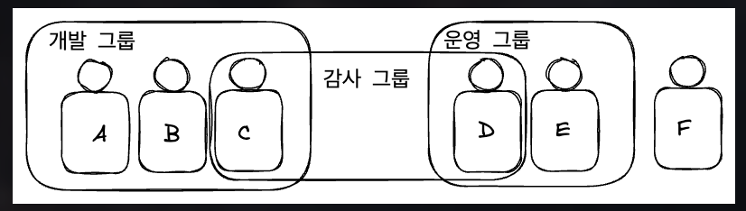

> IAM는 Identity and Access Management의 약자
- [1] IAM를 사용하는 이유
	- [!] AWS계정의 허용범위(permissions)
		-  허용을 위해 권한을 부여
		-  IAM 정책
			- 대상 : 
				1. 사용자
				2. 그룹
			- 형식 : JSON
			- [n] 의미 : *TODO*
			- 목적 : 
				- 어떤 작업 권한에 대한 권한 부여 및 대상
					- 특정 사용자
					- 특정 그룹에 속한 모든 사용자
		- [n] 권한 부여를 해야하는 이유
			- [*] 기본적으로 _AWS는 모든 사용자에게 모든 것을 허용하지 않는다._
				- [i] *새로운 사용자*가 *많은* 서비스를 실행하게 되어 *큰 비용*이 *발생*될 문제가 생길 수 있기 때문임.
			- AWS → 최소 권한의 원칙을 적용 

- [2] 사용자 생성
	- 루트 계정 생성
	- 루트 계정은 계정을 생성하기 위해서만 사용
	- 사용자 단위 : 조직 내 한 사람
- [3] 그룹에 배치 
	- 그룹은 여러개를 만들 수 있음
	- 그룹에는 *사용자*만 배치 할 수 있음
		- A,B,C
		- D,E
	- 반대로 그룹에 소속되지 않는 사용자도 있을 수 있음
		- F
	- 한 사람이 여러 그룹에 소속되는 것도 가능
		- C, D
	- 