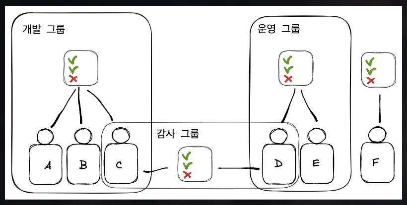

- [1] 정책의 적용 예)
		- 

- [2] 인라인 정책
	- 대상 
		- 사용자
		- 그룹
	- [!] 한 사람이 여러 그룹의 정책에 적용이 되는 것도 가능
			- C, D
	- 정책 구조 및 명명법
		- [자세한 내용은 여기서](https://docs.aws.amazon.com/ko_kr/IAM/latest/UserGuide/reference_policies_grammar.html#policies-grammar-json)
		- version
			- 정책 언어의 버전(형식이라고 보면 될 것 같다)
		- Statement(필수)
			1. Sid
				- Statement의 id
			2. Effect(필수)
				- 접근을 허용 or 거부 설정
				- [p] Allow(허용)
				- [c]  Deny(거부)
			3. Principal(필수)
				- 특정 정책이 허용 대상
					- 사용자
					- 계정 or 역할
			4. Action(필수)
				- Effect에 설정된 항목(허용 or 거부)에 따라 적용될 API 목록
			5. Resource(필수)
				- Action리소스의 목록
			6. Condition
				- Statement가 언제 적용될지 결정
		
