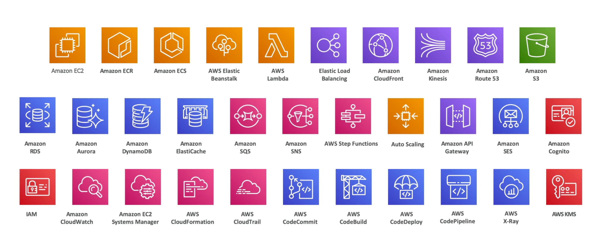

| 구분 | Service |
| --- | --- |
| 1	  | Amazon EC2 |
| 2	  | Amazon ECR |
| 3	  | Amazon ECS |
| 4	  | AWS Elastic Beanstalk |
| 5	  | AWS Lambda |
| 6	  | Elastic Load Balancing |
| 7	  | Amazon CloudFront |
| 8	  | Amazon Kinesis |
| 9	  | Amazon Route 53 |
| 10  | Amazon S3 |
| 11  | Amazon RDS |
| 12  | Amazon Aurora |
| 13  | Amazon DynamoDB |
| 14  | Amazon ElasticCache |
| 15  | Amazon SQS |
| 16  | Amazon SNS |
| 17  | AWS Step Functions |
| 18  | Auto Scaling |
| 19  | Amazon API Gateway |
| 20  | Amazon SES |
| 21  | Amazon Cognito |
| 22  | IAM |
| 23  | Amazon Systems Manager |
| 24  | AWS CloudFormation |
| 25  | AWS CloudTrail |
| 26  | AWS CodeCommit |
| 27  | AWS CodeBuild |
| 28  | AWS CodeDeploy |
| 29  | AWS CodePipeline |
| 30  | AWS X-Ray |
| 31  | AWS KMS |